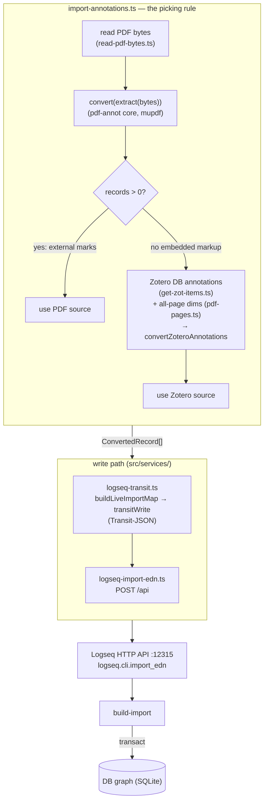

# Architecture — the annotation subsystem

The plugin imports **native PDF annotations** (highlights, underlines, notes made
in Preview, Zotero, Adobe Acrobat, Skim, PDF Expert…) into Logseq as **first-class
DB-graph annotation blocks** — real Logseq highlights you can `((ref))`, query,
backlink, and write commentary on.

Logseq's PDF viewer (PDF.js) will visually *render* a PDF's embedded annotations but
has no data awareness of them: you can't click, link, or query them. This subsystem
reads those annotations out of the PDF (or, when the file has none, out of Zotero's
database), re-expresses their geometry/color/text in Logseq's own annotation schema,
and writes them into the graph so they become part of the knowledge graph.

**Where it lives:** the conversion core is in `src/services/pdf-annot/`; the
orchestration and write path are sibling files in `src/services/`
(`import-annotations.ts`, `logseq-transit.ts`, `logseq-import-edn.ts`,
`read-pdf-bytes.ts`, `find-pdf-asset.ts`). It runs automatically at item import
(single + batch) and on demand via the **Sync annotations** commands.

> **Lineage.** The `pdf-annot/` core began as a faithful, golden-tested port of a
> Python prototype (`pdf-annot-logseq`) where the coordinate math was first worked
> out and validated. It is now **first-party** — new annotation work happens here —
> but the code comments still cite the Python modules (`convert.py`, `geometry.py`,
> …) because the math was copied **verbatim** and must not drift. The golden tests
> are the contract; see [`typescript-port.md`](./typescript-port.md) for the engine
> choice and that lineage in full.

> **See also:** [`overview.md`](./overview.md) for the plain-language tour,
> [`zotero-annotations.md`](./zotero-annotations.md) for the Zotero-database source,
> [`typescript-port.md`](./typescript-port.md) for the engine and module map, and
> [`../logseq-sdk-notes.md`](../logseq-sdk-notes.md) for the general `build-import`
> mechanism §5 builds on.

---

## 1. Tech stack

| Piece | Role | Why it's here |
|---|---|---|
| **TypeScript + React 19** (the plugin) | The whole feature runs inside Logseq's Electron renderer. | A plugin can't shell out to a CLI; extraction, conversion, and the write all happen in-process. |
| **[`mupdf`](https://www.npmjs.com/package/mupdf) (WASM)** | Annotation extraction, word-level covered text, and all-page geometry — the single PDF engine. | It is the **same MuPDF engine** PyMuPDF/fitz wraps, so one dependency plays both Python roles: the raw `/Annots` dict walk (`pikepdf`'s role — sees `/Link`, `/Popup`, off-`/C` colors) and structured-text word extraction (`fitz`'s role). The ~10 MB WASM is **dynamically imported** (`import('./pdf-annot')`), so it loads only the first time annotations are actually imported, not on plugin start. |
| **Logseq desktop HTTP API** (`http://127.0.0.1:12315`, Bearer token) | The live write transport. The plugin POSTs to the method `logseq.cli.import_edn`. | The only route that can set the closed-value `hl-color` ref and the `hl-value` EDN-map — the `@logseq/libs` Editor API sanitizes to scalar user-properties and cannot (§5). |
| **`logseq.db.sqlite.export/build-import`** (in Logseq's `deps/db`) | The actual graph writer behind that API method. | Single source of truth for the write — the same builder backs the CLI, the API import, and the in-app "Import EDN" dialog. The plugin authors to its build-DSL rather than reinventing it. |
| **Golden fixtures** (`src/services/pdf-annot/__fixtures__/`) | The test oracle — captured JSON inputs + their expected `hl-value`/EDN outputs. | The coordinate math is delicate (validated to ~1e-13); the golden tests + fixtures are the contract that keeps refactors honest. |

The Logseq repo at `/Users/rahulsomani/git/logseq` remains the **source of truth for
the schema and the coordinate transform**, in particular:
- `src/main/frontend/extensions/pdf/utils.js` — `viewportToScaled` / `scaledToViewport` / `getBoundingRect` (the stored-position math).
- `src/main/frontend/extensions/pdf/{core,assets,toolbar}.cljs(s)` — the viewer, the highlight-loader query, the annotation list.
- `deps/db/src/logseq/db/sqlite/{export,build}.cljs` — `build-import` and the build DSL (incl. the `:block/parent` honoring at `build.cljs:249`).

---

## 2. Architecture diagram



*The pipeline is PDF/Zotero → records → Transit-JSON → graph. `import-annotations.ts`
is the orchestrator: it reads the file, converts whatever the file carries, and
decides on the **converted records** (not the bare presence of an `/Annots` entry)
whether to use the PDF source or fall back to Zotero. `validate()` (numeric
round-trip) exists in the core and runs in the test suite, but is not on the import
hot path.*

---

## 3. Pipeline stages

Stage 1 (extract → convert → validate) is the `src/services/pdf-annot/` core —
**filesystem-free and environment-agnostic**, so it runs in the renderer. The write
path (stage 2) is the orchestration + transport in `src/services/`.

### `extract` (`pdf-annot/extract.ts`) — ground-truth reconnaissance
- **Input → output:** PDF **bytes** → an `ExtractResult` (one record per `/Annots` entry: subtype, color, geometry incl. `/QuadPoints` decoded to fitz rects, covered page text, `/NM` id) + per-page geometry (width/height in points, rotation, mediabox/cropbox, cropbox offset) for every page **with `/Annots`**.
- **Key idea:** mupdf does both jobs — the raw `/Annots` walk (`page.getObject().get("Annots")`, so Links/Popups/off-`/C` colors are seen) and word reconstruction (from `toStructuredText("preserve-whitespace").walk` char quads, flushing words on whitespace/line boundaries) for the vertical-center covered-text selection. `extract(bytes, sourcePath?)` takes **bytes** (no filesystem), so the plugin passes the asset bytes straight in. One nuance: mupdf reads coordinates as 32-bit floats (e.g. `290.9700012207031` where the literal was `290.97`); this ~1e-5 noise is washed out by the 3-dp rounding in `convert`, so placement is unaffected.

### `convert` (`pdf-annot/convert.ts`) — annotations → Logseq records
- **Input → output:** the extract result → a `ConvertResult` (records carrying the stored `hl-value` shape + diagnostics + skip/empty tallies).
- **Key idea:** apply the three mappings — the **coordinate transform** (§4), **color mapping** (nearest pastel anchor → one of Logseq's 5 fixed colors, or a forced flat color when `opts.color` is set), and **type mapping** (markup subtypes incl. `Highlight` → a text-highlight band over the quads; `FreeText`/`Text` → a text highlight anchored at the flipped `/Rect` with the note text as content; `/Link` and `Popup` skipped quietly; any other subtype skipped with a warning + counted; area/ink not generated). Empty-content blocks are still emitted but tallied. UUIDs are reused from each annotation's `/NM` when well-formed so re-imports are idempotent. Records are sorted deterministically (page, then top, then left). Signature: `convert(extractResult, { assetUuid?, assetTitle?, color? })`.

### `convertZoteroAnnotations` (`pdf-annot/zotero.ts`) — the Zotero-database source
- **Input → output:** parsed Zotero `annotation` items + all-page geometry → the **same** `ConvertResult` shape `convert` produces.
- **Key idea:** Zotero-native annotations aren't in the file — they reach us as `annotation` items over Zotero's local API, with rects already decoded into per-line boxes in PDF user space. The same `flipRect → toStored` transform and the same color mapping apply. A markup's comment becomes a nested **child block**. Block uuids are deterministic v5 UUIDs from `(libraryID, key)` so re-sync upserts. Needs the PDF's page dimensions, which Zotero doesn't supply — so `pageGeometriesFromBytes` (`pdf-pages.ts`) reads them from the file. Full detail in [`zotero-annotations.md`](./zotero-annotations.md).

### `validate` (`pdf-annot/validate.ts`) — round-trip proof
- **Input → output:** the converted records + page geometry → a verdict (`PASS`/`FAIL`/`N/A`) + max numeric error.
- **Key idea:** apply the **exact Logseq inverse** (`scaledToViewport`) to each stored rect and cross-check against `fitz_native × S` (valid because `width == page_w`). Max error `~1e-13`, well under the `1e-6` PASS threshold. This is the **numeric round-trip only** — no Pillow overlay PNGs (the Python prototype kept those; the plugin doesn't need them). `overlays` is always `[]`. It runs in the test suite, not on the import path.

### `import-annotations.ts` — the picking rule (orchestrator)
- **Input → output:** an asset target (`{ assetUuid, pageTitle, absPath, attachmentKey }`) → records written to the graph + an `AnnotImportResult` (`source: 'pdf' | 'zotero' | 'none'`, `count`).
- **Key idea:** `importAnnotationsForAsset` reads the PDF's bytes (`read-pdf-bytes.ts`), runs `convert(extract(bytes))`, and **decides on the converted records**: if that yields any record, the file was annotated externally → use it and **ignore Zotero** (the file is the strictly-better source — it even recovers the FreeText notes Zotero drops on import). Otherwise it falls back to Zotero's database annotations for that attachment (`getRawAnnotationsForAttachment` + page geometry from the file). Keying off *converted records* (not the bare presence of an `/Annots` entry) means a file whose only marks are ink/stamps/form-field widgets converts to zero records and correctly falls through rather than silently importing nothing. `syncAnnotationsForPage` wraps this for the Sync commands, finding a page's PDF asset block(s) and isolating per-target failures. See [`zotero-annotations.md`](./zotero-annotations.md) §9 for the policy rationale.

### `logseq-transit.ts` + `logseq-import-edn.ts` — the write
- **Input → output:** `ConvertedRecord[]` + the asset uuid + the host page title → blocks transacted into the live graph.
- **Key idea:** build the `logseq.db.sqlite.build` import map (`buildLiveImportMap`, mirroring `pdf-annot/edn.ts`'s `emitLiveEdn`), hand-encode it as **Transit-JSON** (`transitWrite` — the arg shape the API method wants, *not* raw EDN), and POST it to the desktop HTTP API method `logseq.cli.import_edn` with the auth token. `importAnnotationRecords` treats an HTTP-200-with-`{error}`-body as a failure (the desktop API wraps a thrown method that way). See §5.

---

## 4. The coordinate transform (the crux)

The hard part is placing a highlight band so it lands on exactly the right glyphs,
at any zoom level, in a renderer (PDF.js) that doesn't share PDF's coordinate
conventions. Every formula here lives verbatim in `pdf-annot/geometry.ts` and is
locked in by `geometry.test.ts`.

### Four coordinate spaces

1. **PDF native** — origin **bottom-left**, **y-up**, units = points (1/72"). `/Rect` and `/QuadPoints` live here.
2. **fitz (top-left points)** — origin **top-left**, **y-down**, points. `page.rect = (0,0,W,H)`. mupdf hands back exactly this space (it is the same MuPDF engine fitz wraps); `extract.ts` emits each markup quad as a top-left rect `[left, top, right, bottom]`.
3. **Logseq stored form** — `{x1, y1, x2, y2, width, height}`, the output of `viewportToScaled` (`utils.js`). `x1..y2` are coordinates; `width`/`height` are the page dimensions the coordinates were captured against.
4. **Viewport pixels** — PDF.js viewport at scale S: top-left, y-down, pixels = `S × points`. This is what the renderer draws.

### Why storing fitz points verbatim is correct (and scale-independent)

Logseq reads a stored rect back **proportionally** (`scaledToViewport`):

```
screen_coord = current_viewport_dim × (stored_coord / stored_dim)
```

So if we store the **fitz rect verbatim** and set `width = page_width_pt`,
`height = page_height_pt`, then at render scale S (viewport dim = `S × page_dim`):

```
px_left = (S × page_w) × x1 / page_w = S × x1
px_top  = (S × page_h) × y1 / page_h = S × y1
```

i.e. read-back is **exactly `fitz_coord × S`**. Because fitz top-left points equal
PDF.js viewport-at-scale-1, the band lands on the right glyphs at *every* zoom level
— the storage is proportional, hence scale-independent. No DPI or zoom value is
baked in. (`toStored` does exactly this; the 3-dp `pyRound` is the only quantization.)

### The y-flip

PDF native is y-up, fitz/viewport are y-down, so for a native rect `[X0,Y0,X1,Y1]`
(`flipRect` in `geometry.ts`):

```
top    = pageH − Y1_native      (native top edge → y-down top)
bottom = pageH − Y0_native
left   = X0 − cropbox_x0        (cropbox origin subtracted; no-op when CropBox == MediaBox)
right  = X1 − cropbox_x0
```

`geometry.ts` reproduces every formula here verbatim — including Python's
round-half-to-even via a `pyRound` helper, so the 3-dp rounded coordinates match
exactly — and `geometry.test.ts` unit-tests the round-trip to `< 1e-9`.

### Multi-quad markup → rects + union bounding

A multi-line highlight/underline has one `/QuadPoints` quad per visual line. Each
quad becomes one `:rects` entry (`quadStoredRects`, sorted top→left, mirroring
Logseq's `optimizeClientRects`). The `:bounding` rect is the **union** of all
per-line rects (`min left, min top, max right, max bottom` — `bounding`), mirroring
`getBoundingRect`.

### How validation proves it

`validate()` applies the exact inverse and compares to `fitz_native × S`: **max
numeric error `~1e-13`** (a clean PASS). The Python prototype additionally rendered
overlay PNGs that visually confirmed boxes sit on the underlined words and note
anchors; the plugin keeps only the numeric proof.

### Validated vs. unvalidated

Validated for the golden sample (rotation = 0, CropBox origin = MediaBox origin). The
cropbox-shift and rotation handling are coded **defensively** but **not** validated;
`convert.ts` warns on `rotation != 0`. See §7.

---

## 5. The write path

Both the at-import flow and the Sync commands end the same way: hand a
`ConvertedRecord[]` to `importAnnotationRecords` (`logseq-import-edn.ts`).

### Transit-JSON over the HTTP API (not a CLI)

The Python prototype delivered the payload with the `logseq import-edn` CLI. The
plugin can't shell out, so it talks to Logseq's **desktop HTTP API** directly:

- `logseq-transit.ts` builds the `logseq.db.sqlite.build` import map
  (`buildLiveImportMap`) and hand-encodes it as **Transit-JSON** (`transitWrite`).
  The API method `logseq.cli.import_edn` expects its single arg to be a
  Transit-encoded string of the build map — *not* raw EDN. (`@logseq/cli`'s own
  `import_edn` command reads the EDN file, parses it, and sends
  `(sqlite-util/transit-write import-map)`; the plugin produces that Transit form
  directly.)
- `logseq-import-edn.ts` POSTs `{ method: 'logseq.cli.import_edn', args: [transit] }`
  to `${base}/api` with the Bearer token, then **inspects the body**: the desktop API
  wraps a thrown method in HTTP 200 + a JSON `{error: …}` body, so a 2xx status alone
  doesn't mean the import landed.

`pdf-annot/edn.ts` still exists and is golden-tested (`edn.test.ts`): it is the
canonical byte-shape of the payload, and `logseq-transit.ts` is kept a mirror of its
`emitLiveEdn`. But the *thing actually sent* over the wire is the Transit encoding,
not the EDN string.

### The build-DSL shape

```clojure
{:pages-and-blocks [{:page {:block/title "<existing reference page>"}
                     :blocks [<annotation blocks…>]}]
 :properties {}
 :classes {}}
```

The general DSL — the top-level three keys, the `:build/*` convenience keys, and why
this path rather than the `@logseq/libs` Editor API (which can't set a closed-value
ref or an EDN-map value) — lives in
[`../logseq-sdk-notes.md`](../logseq-sdk-notes.md) → *Writing typed blocks…*. What's
**annotation-specific** is the block schema below.

### The `Pdf-annotation` block schema

A Logseq PDF annotation is an ordinary block that (a) is tagged
`:logseq.class/Pdf-annotation`, (b) carries a fixed set of typed properties, and (c)
points at the PDF's asset block. The class **requires** five properties
(`deps/db/src/logseq/db/frontend/class.cljs`) — omit one and the block is invalid:

| Attribute | Type | Value |
|---|---|---|
| `:build/tags` | class ref | `[:logseq.class/Pdf-annotation]` |
| `:block/title` | string | the highlighted text (or, for a note, the note text) — the readable body, and what the annotation list shows |
| `:logseq.property/ls-type` | keyword | `:annotation` (constant) |
| `:logseq.property/asset` | entity ref | the PDF **asset block** (`[:block/uuid #uuid "…"]`) — **the key the viewer's loader query uses** (below) |
| `:logseq.property.pdf/hl-color` | closed-value ref | one of `:logseq.property/color.{yellow,red,green,blue,purple}` — the **db-ident**, not the string |
| `:logseq.property.pdf/hl-page` | int | 1-based page number |
| `:logseq.property.pdf/hl-value` | EDN map | the full geometry/content record (sub-shape below) |

The renderer reads geometry and color **only** from `hl-value`; the individual
`hl-page`/`hl-color` properties exist for queries and the annotation list. The five
color db-idents are fixed (`yellow → :logseq.property/color.yellow`, likewise the
other four) — no orange, no custom hex. The block property stores the **db-ident**;
`hl-value`'s `:properties {:color "…"}` stores the lowercase **name** string. (Passing
the string to `hl-color` fails the build with *"Tempids used only as value"*.)

**The `hl-value` sub-shape** — the entire highlight map the live app persists verbatim.
Position fields are `viewportToScaled` output — keys `{:x1 :y1 :x2 :y2 :width
:height}`, **not** `{:left :top …}`. Read-back (`scaledToViewport`) **throws** *"You are
using old position format"* if `:x1` is missing, so every rect (`:bounding` and each
`:rects` entry) must carry all six numbers:

```clojure
{:id        #uuid "…"           ; MUST equal the block's :block/uuid
 :page      3                    ; 1-based int (also the grouping key at render)
 :position  {:page     3
             :bounding {:x1 .. :y1 .. :x2 .. :y2 .. :width 612.0 :height 792.0}
             :rects    [{:x1 .. :y1 .. :x2 .. :y2 .. :width 612.0 :height 792.0} …]}
 :content   {:text "the highlighted text"}   ; NO :image key for a text highlight
 :properties {:color "yellow"}}              ; lowercase NAME string (matches hl-color)
```

- `:width`/`:height` are the page dims in points at scale 1.0 (US-Letter `612.0 ×
  792.0`); storing the rect verbatim in PDF points makes read-back proportional, hence
  scale-independent (§4).
- `:rects` is one entry per visual line (per `/QuadPoints` quad), sorted top→left;
  `:bounding` is their union. Keep `:rects` non-empty or the highlight isn't
  clickable/visible.
- Store floats with a decimal point so the EDN reader yields a double (`edn.ts`'s
  `ednFloat` renders integral values as `"N.0"`; Transit sends them as JSON numbers,
  which the reader also treats as doubles).

A **literal** text-highlight block (a red sticky-note on page 1, from the golden
fixture; page dims rounded for readability, the asset uuid a placeholder — at import
it's the uuid of the PDF asset block the plugin just created):

```clojure
{:block/uuid #uuid "b5d9eea7-ca28-4f7c-9b00-87a84bf88763"   ; == hl-value :id
 :block/title "Make sure to check these out!"
 ;; attach under the existing PDF asset block by uuid — but never re-declare it (below)
 :block/parent {:db/id [:block/uuid #uuid "6a189ba1-a16a-4f18-b563-daacc36dc98d"]}
 :build/keep-uuid? true                                     ; idempotent re-import
 :build/tags [:logseq.class/Pdf-annotation]
 :build/properties
 {:logseq.property/ls-type :annotation
  :logseq.property/asset [:block/uuid #uuid "6a189ba1-a16a-4f18-b563-daacc36dc98d"]
  :logseq.property.pdf/hl-color :logseq.property/color.red  ; closed-value db-ident
  :logseq.property.pdf/hl-page 1
  :logseq.property.pdf/hl-value
  {:id #uuid "b5d9eea7-ca28-4f7c-9b00-87a84bf88763"
   :page 1
   :position {:page 1
              :bounding {:x1 492.725 :y1 136.657 :x2 510.725 :y2 154.657
                         :width 595.276 :height 841.89}
              :rects [{:x1 492.725 :y1 136.657 :x2 510.725 :y2 154.657
                       :width 595.276 :height 841.89}]}
   :content {:text "Make sure to check these out!"}
   :properties {:color "red"}}}}
```

On the **Zotero path** a markup's comment is attached as a `:build/children` block
(`{:block/title "my note…" :build/keep-uuid? true}`). **Area highlights** (a figure
crop) are not emitted (no portable source equivalent; they'd need a generated PNG
asset) but for completeness add `:logseq.property.pdf/hl-type :area`, an
`:logseq.property.pdf/hl-image` ref to a PNG asset block, `:block/collapsed? true`, and
`hl-value` `:content {:text "" :image […]}` with `:rects []`.

### Attach-to-existing-asset

The PDF viewer loads highlights with one Datascript query (`assets.cljs`) — it finds
every block whose `:logseq.property/asset` points at the asset block, **regardless of
tree position**:

```clojure
[:find (pull ?e [*]) :where [?e :logseq.property/asset ?asset-eid]]
```

So a highlight renders as long as it carries that ref. To match native structure
(annotations as children of the asset block) without corrupting the existing asset, the
writer:

- **declares** the annotation blocks under the existing reference **page** (matched by `:block/title`, so `build-import`'s existing-entity check recognizes it and only minimally touches it), and
- **sets** `:block/parent {:db/id [:block/uuid <asset-uuid>]}` explicitly on each block (honored at `build.cljs:249`).

The asset block itself is **referenced by UUID, never re-stated** — re-declaring it
would re-parent or duplicate it (`build-import` only dedupes pages/classes/properties,
not arbitrary nested blocks). The asset block (its tags, `external-url`, checksum) is
created by the plugin's own import flow in `handle-zot-db.ts`; this subsystem only
attaches to it. The general "attach children under an existing block without
re-declaring it" trick is in [`../logseq-sdk-notes.md`](../logseq-sdk-notes.md).

### Safety / idempotency

Imports are purely **additive** — new blocks only; nothing existing is modified.
UUIDs reused from `/NM` (PDF path) or derived deterministically from
`(libraryID, key)` (Zotero path) make re-runs upsert rather than duplicate. The
at-import call is **best-effort and isolated** (a failure never fails the item
import); the Sync paths isolate per-target and per-page failures. Undo = delete the
`:logseq.class/Pdf-annotation` blocks under the asset.

---

## 6. Subsystem layout

```
src/services/
├── import-annotations.ts        # ORCHESTRATOR: the picking rule (PDF-first → Zotero), Sync entry
├── logseq-transit.ts            # build map → Transit-JSON encoder (mirrors edn.ts emitLiveEdn)
├── logseq-import-edn.ts         # POST the Transit payload to the desktop HTTP API; token/test helpers
├── read-pdf-bytes.ts            # read a PDF's bytes off its file:// path (fetch → XHR fallback)
├── find-pdf-asset.ts            # locate a page's PDF asset block(s) for Sync (external-url + attachment key)
└── pdf-annot/                   # THE CORE (filesystem-free, mupdf):
    ├── index.ts                 # public API (what the glue imports)
    ├── types.ts                 # shared type contract (serialized shapes keep snake_case keys)
    ├── extract.ts               # PDF bytes → annotation records via mupdf (raw /Annots + words)
    ├── convert.ts               # → Logseq hl-value records (transform + color + type + tallies)
    ├── zotero.ts                # Zotero-DB annotations → the same record shape
    ├── pdf-pages.ts             # all-page geometry via mupdf (for the Zotero path)
    ├── edn.ts                   # build-DSL EDN serializers (canonical shape; golden-tested)
    ├── geometry.ts              # the validated coordinate transform, verbatim (pyRound)
    ├── colors.ts                # palettes + nearest-pastel color mapping
    ├── uuid.ts                  # deterministic v5 uuid (Zotero idempotency)
    ├── validate.ts              # numeric round-trip proof (no overlays)
    ├── *.test.ts                # 123 bun tests across 6 files (golden parity + units)
    └── __fixtures__/
        ├── pdf-golden/xu-et_al_2025_qwen3-omni_technical_report__pdf-expert/
        │   ├── annotations.json, pages.json     # extract output (golden inputs to convert)
        │   └── logseq-annotations.{json,edn}    # convert/edn golden outputs
        └── zotero/LKXJEQ5S.{annotations,pages,expected}.json + .expected.edn
```

There is **no CLI module** in this repo (the prototype's `cli.ts` was not brought
over — the plugin is the only consumer, and it imports the core directly). The
`index.ts` header still mentions a `./cli` for historical reasons; ignore it.

---

## 7. Current status & known gaps

**Works:** annotation import ships in the plugin — at single import, at batch import,
and via `Zotero: Sync annotations` (page menu) / `Zotero: Sync all annotations`
(command palette). Both the PDF-native path and the Zotero-database fallback are
wired and idempotent. The core is covered by **123 bun tests across 6 files** (all
green, 335 assertions): `convert`/`edn`/`validate` golden-parity against the vendored
`xu-…__pdf-expert` fixture, `zotero` golden-parity against the `LKXJEQ5S` fixture, and
`geometry`/`colors` units (incl. the scale-independent round-trip to `< 1e-9`).

**Test coverage caveat — extract is not tested in-repo.** The source PDF is **not
vendored** (only the JSON the prototype extracted from it). So `extract.ts` — the one
mupdf-dependent stage — has **no in-repo test**; `convert`/`edn`/`validate` are tested
against its golden JSON output instead. The other three prototype golden dirs aren't
vendored either, so `convert` parity is proven against **one** fixture dir here. When
changing `extract`, run it against real PDFs by hand.

**Known gaps / risks:**
- **Rotation `≠ 0`** — coded defensively but **unvalidated**; `convert.ts` (and `zotero.ts`) warn and emit rot-0 geometry. The sample had no rotated pages.
- **Non-zero CropBox origin** — the cropbox shift is coded but **unvalidated** (sample's CropBox == MediaBox).
- **Area / Ink annotations not generated** — area highlights need a real PNG asset (no portable source equivalent yet); `Ink`/freehand has no Logseq construct. Both are skipped (warned + tallied). `Underline`/`StrikeOut`/`Squiggly` import as text-highlight bands, so the line *look* is lost (content and anchor are preserved; not round-trippable).
- **Color anchors mis-bucket pale/desaturated sources** — `colors.ts`'s `yellow` anchor is *saturated* gold `(255,213,0)` while the other four are pastel, so a **pale/cream** source color is nearest to pastel *salmon* and maps to `red`, not `yellow` (seen on the cream `#FCF5A4` and peach `#FFCCA1` golden cases → both `red`). This faithfully reproduces the validated nearest-pastel logic (orange→yellow, confirmed visually on the sample), so it is not a regression — but the anchors are worth revisiting against Logseq's *actual* `--color-*-300` token RGBs and **re-validating** before changing. Escape hatch: the **Annotations** setting `annotationColor` forces a single flat color for every highlight, bypassing inference.
- **Imported PDFs whose bytes aren't on this machine are skipped.** Annotations attach to an **asset block**, which `handle-zot-db.ts` creates for any PDF whose bytes are on disk — `linked_file` (from its `data.path`) and `imported_file`/`imported_url` (from Zotero's enclosure `file://` URL, gated on `enclosure.length`, which Zotero sets only when the stored bytes are present). An `imported_file` whose bytes were never synced to this machine (`length` unset) becomes a plain Markdown link instead — no asset block, so no annotation import. Path resolution itself is never the blocker (see [`../zotero-attachment-paths.md`](../zotero-attachment-paths.md)).
- **In-viewer multi-zoom check** — proven offline by `validate()`; trusting the live PDF.js renderer matches the same proportional storage the live save path uses.
- **Engine precision note (benign).** mupdf reads raw coordinates as 32-bit floats, so diagnostic raw fields can read `290.9700012207031` vs a literal `290.97`; the ~1e-5 noise is absorbed by the 3-dp rounding, so the stored geometry — and the placement — is identical. Detail in [`typescript-port.md`](./typescript-port.md) §6.
